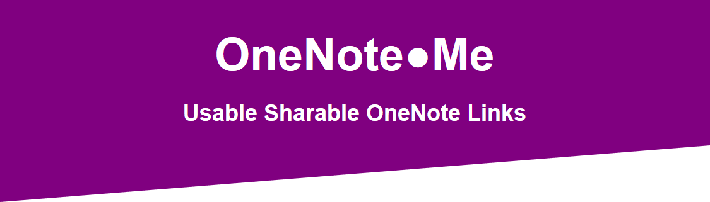

[](https://1note.me/)

[](https://app.netlify.com/sites/1noteme/deploys)

## What is it

Get an easy to use OneNote link that can be shared through messaging apps and will open with OneNote Desktop.

## Usage

Check out this video to the simplest use case: https://streamable.com/v4snk

## Why build it

This was a huge pain point in my previous work place. We used OneNote daily, and there was no easy way to share the OneNote links in Slack. **Now there is**.

## Why not use a link shortner

Link shortners I tried did not support the `onenote:` prefix and would not open in OneNote Desktop.

## How is it build

- [Netlify](https://www.netlify.com/) to serve `html`, `css`, and `js` files. I opted for pure `js` and `css` to keep things simple.
- [Netlify Functions](https://www.netlify.com/products/functions/) to serve as a *backend server* (serverless)
- [AWS S3](https://aws.amazon.com/s3/) as a [key-value store](https://en.wikipedia.org/wiki/Key-value_database). Generate an id (using [shortid](https://www.npmjs.com/package/shortid)), store the link in S3.

## How to run locally

Install [Netlify Dev](https://www.netlify.com/products/dev/#how-it-works) and configure it. Then you can run the following command:

```powershell
netlify dev --functions=.\functions
```

You will also need to set the following environment variables:

- `AWS_ACCESS_KEY_ID_RW` - the AWS access key for S3
- `AWS_SECRET_ACCESS_KEY_RW` - the access key secret

## Report issues

Report any issues through GitHub:

- [New Issue](https://github.com/damosullivan/1note.me/issues/new)
- [Current Issues](https://github.com/damosullivan/1note.me/issues)

[](https://damien.ie/)
